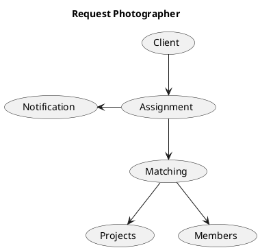

```plantuml
@startuml

skinparam backgroundColor "#FFFFFE"

title Request Photographer

"Client" as (v1)
"Assignment" as (v2)
"Notification" as (v3)
"Matching" as (v4)
"Projects" as (v5)
"Members" as (v6)

v1 --> v2
v3 <- v2
v2 --> v4
v4 --> v5
v4 --> v6

@enduml
```
